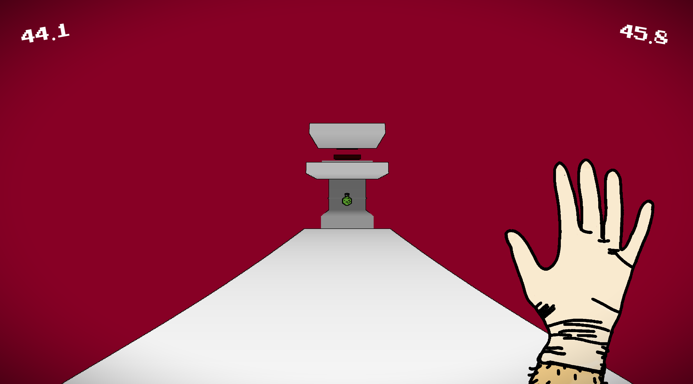

# memento mori
3D platformer made in construct 3 with raycasting algorithm  
## Description:
You are put in an interdimensional limbo. The time perception is different here. You age so fast, that you will die after 60 seconds being here, so you have  
to complete the platforming challange before you die.  
memento mori.  
### Live demo and screenshots:  
[LIVE DEMO](http://portfolio.mcgo.pl/memento/)  
Screenshots:  

  

